# E-commerce App

This is a Flutter e-commerce application built as part of a technical assignment task. The app uses FakeStoreAPI for backend services and implemented MVVM architecture with BLoC state management.

## Features Implemented

### Required Features

- **Login**: JWT-based authentication with secure token storage
- **Product Listing**: Browse all products with category filtering
- **Product Details**: View product information with "Add to Cart" functionality
- **Cart Management**: View cart items, see product details, remove items, calculate totals
- **User Profile**: Display user information and address

### Bonus Features

- Pull-to-refresh on product list
- Dark mode toggle
- Search bar for products

## Tech Stack

- Flutter: 3.29.2 (Stable)
- Dart: 3.7.2
- flutter_bloc (State Management)
- Dio (Networking)
- flutter_secure_storage (Token Storage)
- cached_network_image (Image Loading)
- flutter_screenutil (Responsive UI)

## How to Run

1. **Clone the repository:**

   ```bash
   git clone https://github.com/zeeshanhaider60/ecommerce-app.git
   cd ecommerce-app
   ```

2. **Install dependencies:**

   ```bash
   flutter pub get
   ```

3. **Run the app:**
   ```bash
   flutter run
   ```

## APK Download

Direct APK download: [app-release.apk](https://github.com/zeeshanhaider60/ecommerce_app/blob/main/build/app/outputs/flutter-apk/app-release.apk)

Or build yourself:

```bash
flutter build apk --release
```

## Demo Credentials

- **Username:** mor_2314
- **Password:** 83r5^\_
- **Note:** You can also log in using credentials of other users. You can get the usernames and passwords from the FakeStoreAPI users endpoint: https://fakestoreapi.com/users

## What Features Are Working

| Feature         | Status     | Notes                                   |
| --------------- | ---------- | --------------------------------------- |
| Login           | ✅ Working | JWT token stored securely               |
| Product List    | ✅ Working | With categories and search              |
| Product Details | ✅ Working | Add to cart functional                  |
| Cart            | ✅ Working | Shows items with images, prices, totals |
| Profile         | ✅ Working | User details displayed                  |
| Dark Mode       | ✅ Working | Toggle in app bar                       |
| Pull to Refresh | ✅ Working | On product list                         |
| Logout          | ✅ Working | Clears token and navigates to login     |

## Architecture

- **MVVM Pattern**: Models, Views, ViewModels separated
- **BLoC State Management**: For predictable state handling
- **Repository Pattern**: For data layer abstraction
- **Clean Architecture**: Proper folder structure

## API Used

FakeStoreAPI (https://fakestoreapi.com/)

Endpoints:

- POST /auth/login - Authentication
- GET /products - Product list
- GET /products/:id - Product details
- GET /products/categories - Categories
- POST /carts - Add to cart
- GET /carts/user/:id - Get user carts
- DELETE /carts/:id - Remove from cart
- GET /users/:id - User profile

## Screenshots

All screenshots are located in the `screenshots/` folder.

### Light Mode

| Login                            | Products                               | Products with Search                                 |
| -------------------------------- | -------------------------------------- | ---------------------------------------------------- |
| 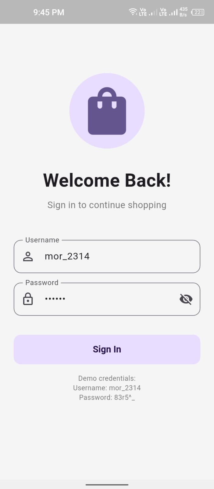 | 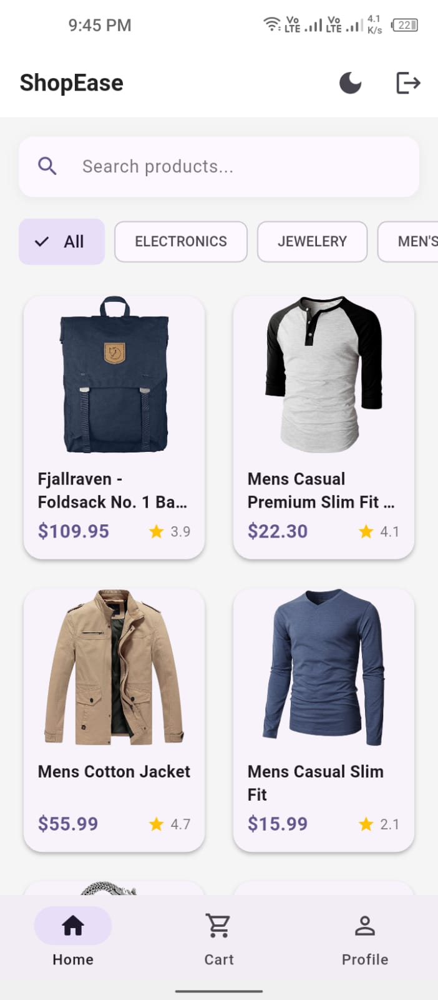 | 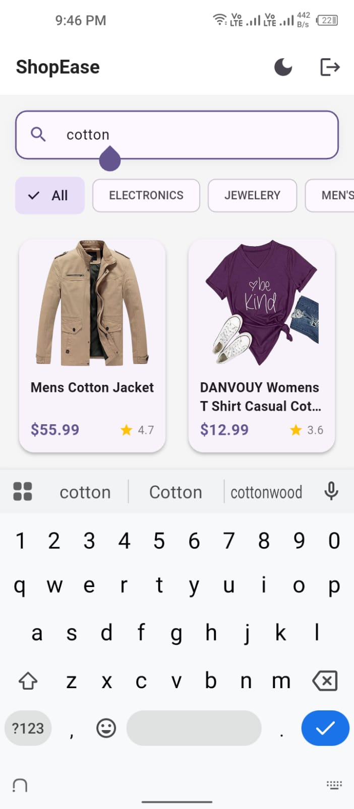 |

| Products Category                                        | Product Detail                                     | Product Detail 2                                       |
| -------------------------------------------------------- | -------------------------------------------------- | ------------------------------------------------------ |
| 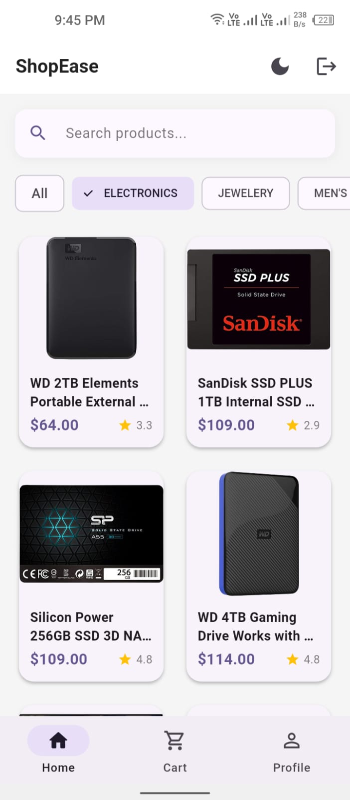 | 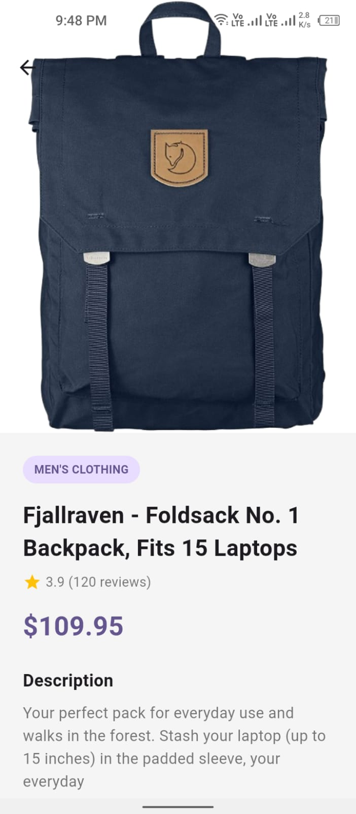 | 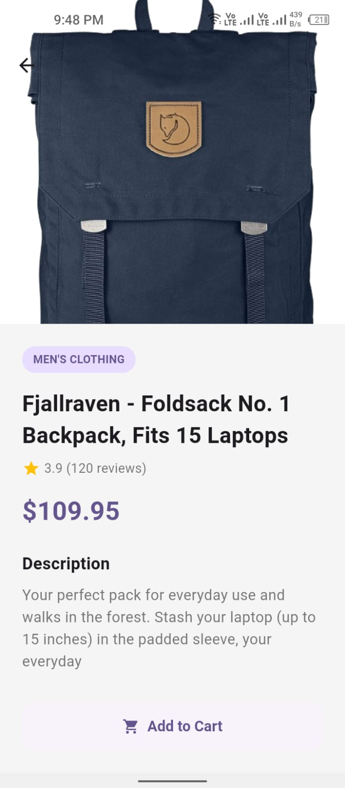 |

| Cart                           | Profile                              |
| ------------------------------ | ------------------------------------ |
| 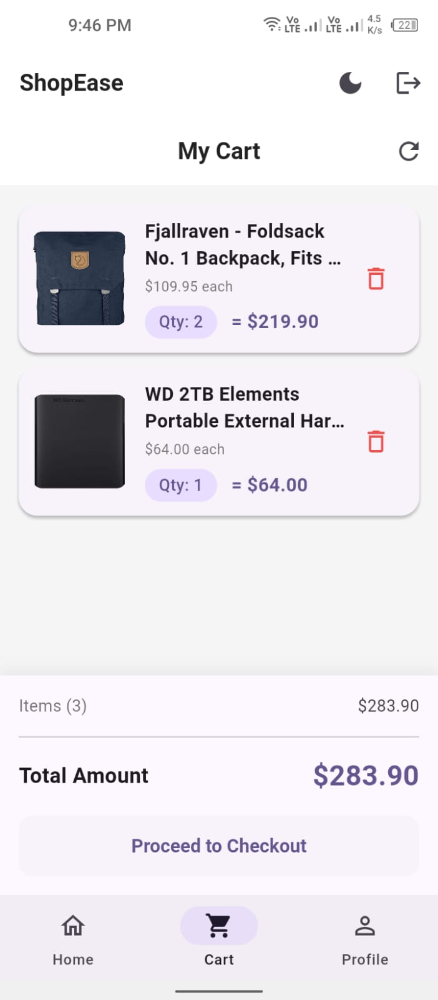 | 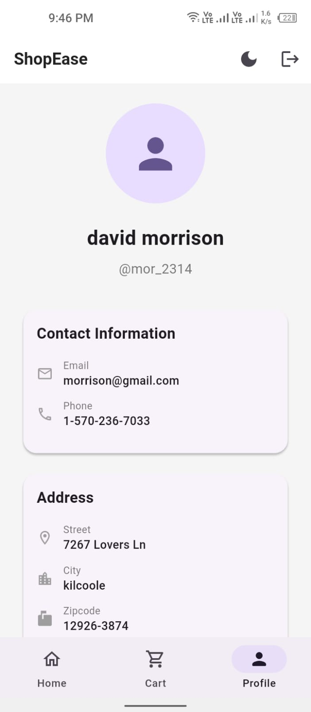 |

### Dark Mode

| Products                                              | Products Search                                            | Product Detail                                            |
| ----------------------------------------------------- | ---------------------------------------------------------- | --------------------------------------------------------- |
| 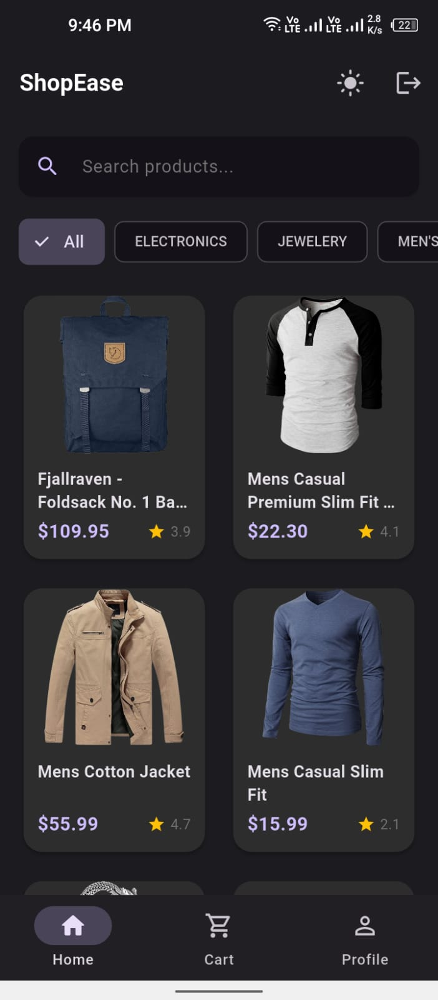 | 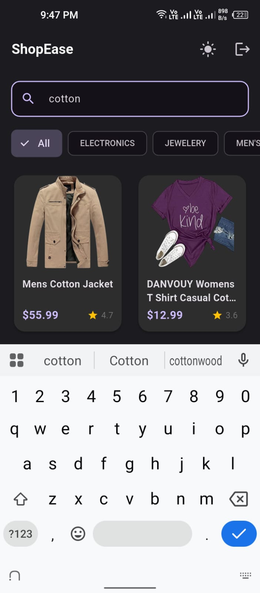 | 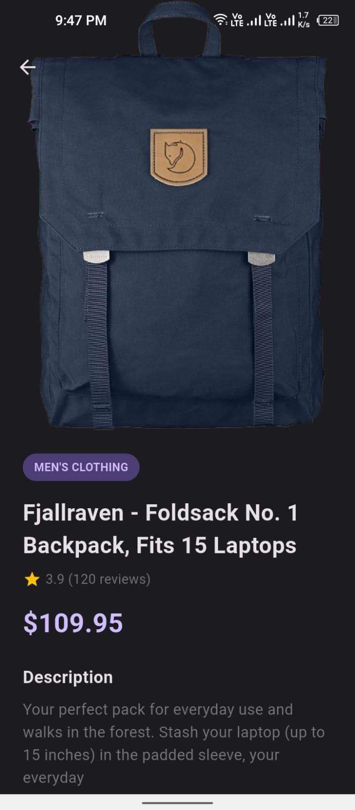 |

| Product Detail 2                                              | Cart                                          | Profile                                             |
| ------------------------------------------------------------- | --------------------------------------------- | --------------------------------------------------- |
| 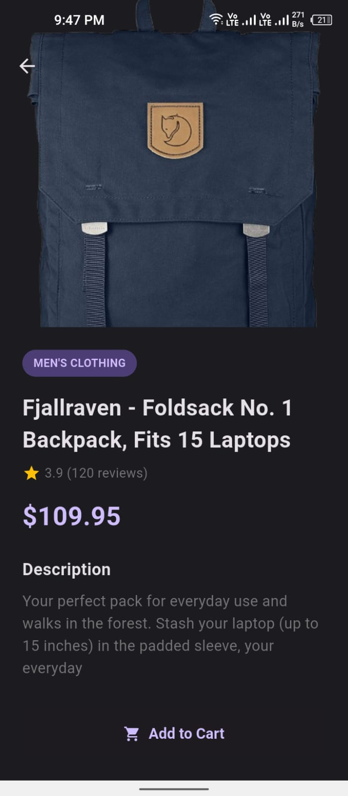 | 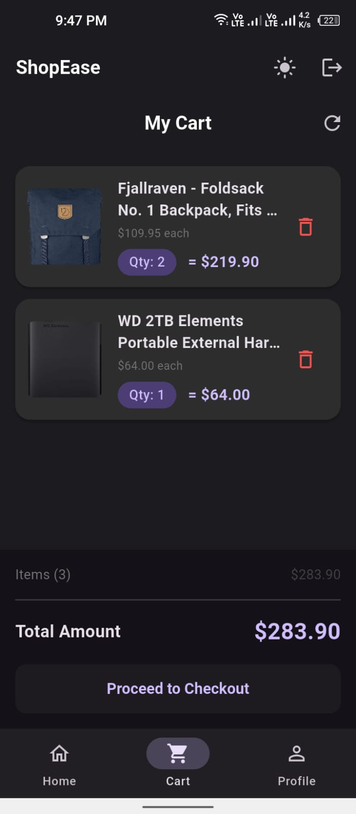 | 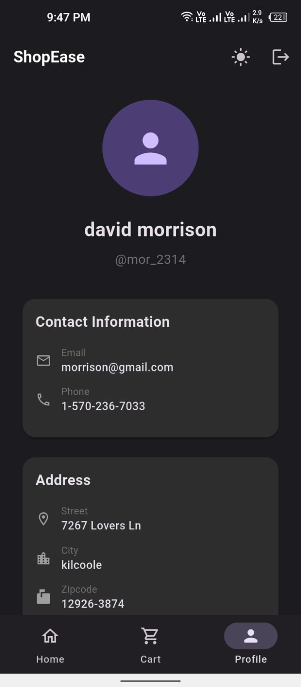 |

## Screen Recording

Full app screen recording video is located in the `screen_recording/` folder.

**File:** `screen_recording/screen_recording.mp4`

## Project Structure

```
lib/
├── config/          # Routes and themes
├── core/            # Constants
├── data/            # Models and repositories
├── domain/          # Entities
├── presentation/    # Screens and BLoCs
└── services/        # Storage service

screenshots/         # App screenshots
screen_recording/    # App screen recording video
```
